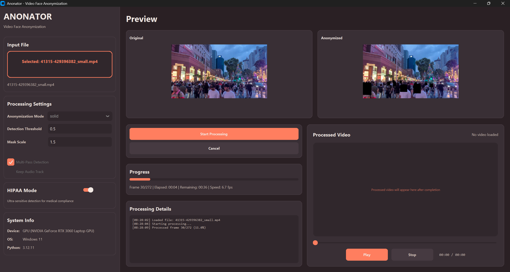

# Anonator

**Video face anonymization tool with GPU acceleration and HIPAA compliance mode**



Desktop application for automatic face detection and anonymization in videos. Supports blur, pixelation, and solid black box anonymization methods.

## Features

### Face Detection & Anonymization
- **GPU Accelerated**: CUDA support with PyTorch (10x faster than CPU)
- **Three Modes**: Blur, solid black box, or mosaic pixelation
- **RetinaFace Model**: ResNet50 backbone for accurate detection
- **Real-time Preview**: Side-by-side original and anonymized frames
- **Video Playback**: Built-in player for processed videos

### HIPAA Compliance Mode
- Multi-pass detection with configurable thresholds
- Automatic audio removal for voice privacy
- Adjustable mask scale for complete coverage
- Locked settings to prevent accidental changes

### Interface
- Modern two-pane layout with controls and live preview
- Drag and drop video loading
- Progress tracking with FPS counter and time estimates
- Video player with playback controls

### Formats
- **Input**: MP4, AVI, MOV, MKV, WEBM
- **Output**: MP4 with H.264 encoding
- Optional audio preservation

## Requirements

- **OS**: Windows 10/11 (64-bit)
- **RAM**: 4GB minimum, 8GB+ recommended
- **GPU**: Optional NVIDIA GPU with CUDA support for acceleration
- **Python**: 3.9 or higher

## Installation

```bash
# Install PyTorch with CUDA support
uv pip install torch torchvision --index-url https://download.pytorch.org/whl/cu126

# Install face detection
uv pip install --no-build-isolation git+https://github.com/hukkelas/DSFD-Pytorch-Inference.git

# Install dependencies
uv sync

# Install additional packages
uv pip install opencv-python Pillow imageio imageio-ffmpeg tkinterdnd2 pyinstaller "numpy<2"
```

Or use Makefile:
```bash
make dev
```

## Usage

**Start the application:**
```bash
make run
# or
python -m anonator.main
```

**Process a video:**
1. Drag and drop video file into the application
2. Select anonymization mode (blur, solid, or mosaic)
3. Adjust settings as needed
4. Click "Start Processing"
5. Output saved with "_anonymized" suffix

## Demo Videos

Test videos included in `testData/`:
- `134436-759734820_small.mp4` → `134436-759734820_small_anonymized.mp4`
- `41315-429396382_small.mp4` → `41315-429396382_small_anonymized.mp4`

## Configuration

Edit `src/anonator/core/config.py` to customize:
- Detection thresholds and mask scale
- Multi-pass detection settings
- Blur and mosaic effects
- Performance settings (FP16, max resolution)

## Project Structure

```
src/anonator/
├── core/          # Video processing and face detection
├── ui/            # GUI components and widgets
└── main.py        # Application entry point
tests/             # Test suite (130+ tests, 80%+ coverage)
```

## Development

```bash
# Run tests
make test

# Build executable
make build

# See all commands
make help
```

## Building

```bash
make build             # Build executable
make build-onefile     # Build single .exe
```

Executable output: `dist/Anonator/Anonator.exe`

## Tech Stack

- **Face Detection**: [RetinaFace](https://arxiv.org/abs/1905.00641) (ResNet50) via [DSFD-Pytorch-Inference](https://github.com/hukkelas/DSFD-Pytorch-Inference)
- **Deep Learning**: [PyTorch](https://github.com/pytorch/pytorch) with CUDA support
- **Video Processing**: [OpenCV](https://opencv.org) with FFmpeg
- **GUI**: Tkinter with [tkinterdnd2](https://github.com/pmgagne/tkinterdnd2)

## License

MIT License

---

**Keywords**: video face anonymization, face blur, video privacy, HIPAA compliance, face detection, PyTorch, GPU acceleration, medical video anonymization, automatic face blurring
